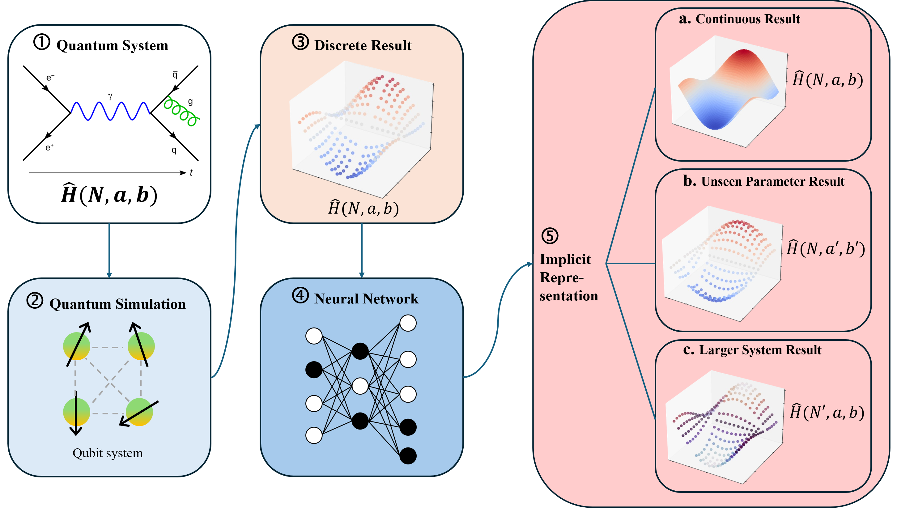

# NN-IQS

This is the repository for article AI-ehanced Quantum Simulation of Schwinger Model



## Introduction

We proposed a hybrid model named Neural Network Facilitated Quantum Simulation model, or the NN-IQS model.
It utilizes a neural network to implicitly represent a famous quantum system, the Schwinger Model.
After training with discrete resuts from quantum simulation, our NN-IQS model can easily generate extra samples on the Schwinger Model phase diagram with arbitrary resolution and high precision.
It can even predict sample points outside the training parameter range and beyond system size limitation.
The model is highly flexible and can be easily generalized to other quantum systems.


## Dataset
Datasets used in this research are exclusively generated by ourselves through simulator. 

The operators.py file contains the target Hamiltonian and observables expressed as Kronecker products,
while the dataset.ipynb file contains our source codes behind dataset generation.

Some packages might need to be installed beforehand.

```python 
pip install scipy
pip install pillow
pip install qutip
pip install pandas
```

## To begin training
Figure 4 is to show the training curve of the neural network.

It includes training loss, test loss, and test psnr.

Resolution used to generate the training and validation dataset is 196x196.
### csv file
The csv file recorded the three values associated with each epoch.
### ipynb file
The ipynb file simply serves as a graph plot. The file directory might need to be adjusted.

## Figure 5
Figure 5 is two box plots to show the relative error distribution.
### error dataset
There are several important points to note about the error dataset.

* The dataset contains relative error for all up-scaling ratios. That is, seen ratios x2, x3, x4, and unseen ratios x6, x8, x10.

* For each ratio, there are 8 corresponding files.

  For example, for x2, you would have 2_times, 2_times interpo, 2_times_cubic, 2_times_bicubic and each of their transition versions.

  They each stand for NN-IQS prediction, bilinear interpolation, separate cubic interpolation, bicubic interpolation, and their corresponding statistics within the transition region.

* For the whole phase diagram files, relative error is stored in a 2D array form.

  Each point on the phase diagram is error estimated separately.

  For the transition region files, the wanted data points are further picked from the array to form a 1D list.

  The difference can also be seen from the import in the ipynb file.

* We keep the input resolution as 48x48.

  x2, x3, and x4 are tested with the original 196x196 resolution dataset.

  While x6, x8, and x10 are tested with a newly generated 480x480 resolution dataset.

  The number of error files will be different therefore.
### ipynb file
This file import all the data and plot the graph.

Note that the import steps may have a little difference for the two types of files (whole diagram and transition region), and that the directory may need to be adjusted.

## Figure 6 & 8
These two figures are two demonstrations on the NN-IQS error control skill.

Figure 6 is plotted with this old parameter setting.

```python 
g = 3
N= 8
w = 3
m = 0
```

While Figure 8 is an extrapolation to N=12 large system, the parameter setting is.

```python 
g = 3
N= 12
w = 3
m = 0
```

These two figures are both trying to up-scale from 48x48 resolution to 192x192 resolution.
### datasets
The two datasets contains N = 8 and N = 12 data correspondingly. The four npy files in each folder are used in the ipynb file.

The interpolation in these two figures both refers to bilinear interpolation.
### ipynb file
All eight graphs are plotted.

To identify transition region and show the region only. I have written the code to identify transition region on my own.
It may not be satisfying.

All the file directory may need to be adjusted.

## Figure 7
Figure 7 is done by separating the original training and validation datasets.

Only part of w values are used in training and validation process. The rest unseen ones are used in the test.
### error dataset
The instruction of this error dataset is similar to that of Figure 5, 
just that only x2, x3, x4 are included this time.
### ipynb file
The python file is also similar.

All file directory may need to be adjusted.

The bold words 'Whole Diagram' and 'Transition Region' on the Figure in overleaf are added through ppt.

## Tables
The current tables are established on Latex directly.
